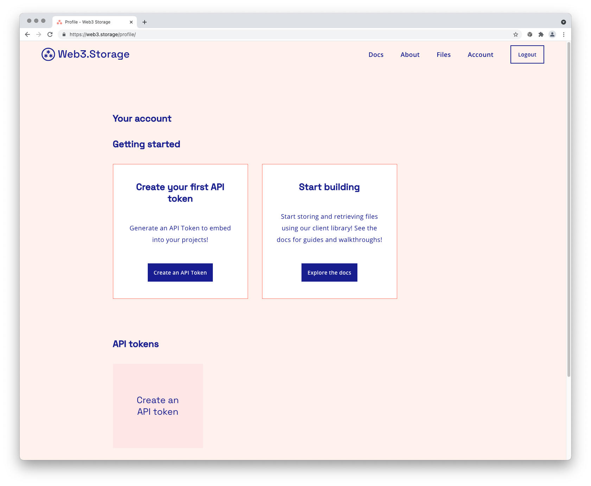
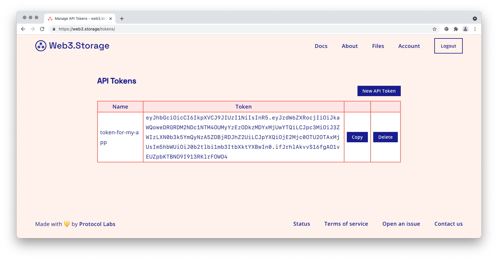

# How to generate an API token

In this how-to guide, **you'll learn how to generate a Web3.Storage API token** so that you can interact with the service programmatically through the [JavaScript client library](../reference/client-library.md) or using the command line.

You'll need a free Web3.Storage account in order to generate an API token. If you already have an account, read on. If not, have a look at the [quickstart guide](../intro.md#quickstart) to get up and running in just a few minutes.

## Create a new token

1. From the Web3.Storage navigation menu, click **Account** to go to your [account page](https://web3.storage/account).
1. Scroll down to the **API tokens** section and click **Create an API token**. (If you've never created an API token on Web3.Storage before, you'll also see an invitation to do this from the **Getting started** section of your account page.)

3. Give your new API token a descriptive name that will be easy for you to remember later.

:::tip
You don't have to use the same API token for all of your projects! Creating an individual API token for each of your applications or services makes it easier to change or revoke access in the future to a specific project. You can have as many tokens as you need on Web3.Storage for free.
:::

4. Click **Create**. You'll then be taken to your [API Tokens](https://web3.storage/tokens) page, where you can manage all of your Web3.Storage API tokens.

5. Make a note of the **Token** field somewhere secure where you know you won't lose it. You can click **Copy** to copy your new API token to your clipboard.

:::warning Keep your API token private 
Do not share your API token with anyone else. This key is specific to your account.
:::

## Delete a token

If you no longer need a particular Web3.Storage API token — for example, you've sunsetted a project using a particular token — you may wish to delete it for security reasons. To do so, simply visit your [API Tokens](https://web3.storage/tokens) page and click **Delete** to remove it.

:::danger Deleting a token is permanent 
Remember that if you delete an API token, it's removed permanently and cannot be restored. Delete a token only if you're sure you won't need it again.
:::

## Next steps

Now that you have an API token, you can store and retrieve data from your apps and services, as well as from the command line. If you haven't yet explored in depth how to store data using Web3.Storage, check out the [storage how-to guide](./store.md) for a deep dive on how to upload files using the [JavaScript client library](../reference/client-library.md).

To learn in greater detail how to fetch your data using the Web3.Storage client, or directly from IPFS using a gateway or the IPFS command line, see the [how-to guide on retrieval](./retrieve.md).

You can also use the JavaScript client library to get more information about the status of your data. See the [query how-to guide](./query.md) to learn how to get more details about your data, including the status of any Filecoin storage deals.
